# vue-chat-app

此為 Vue + Pinia + Websocket 的小專案，主要練習使用 Pinia 做狀態管理。

> 若想練習 web socket 或其他框架的實現，可搭配 [chat-app-backend](https://github.com/JiaHongL/chat-app-backend) 這個後端專案。

## 此專案已實現功能

- 大廳功能 (多對多)
- 私訊功能 (一對一)
- 好友即時上線狀態
- 回覆指定訊息
- 收回訊息 & 恢復訊息
- 已讀功能
- 新訊息通知
- 傳送圖片 (支援截圖貼上)
- 左右滑動切換頁面 (mobile)
- 右滑關閉聊天室窗 (mobile)

## 系統架構圖

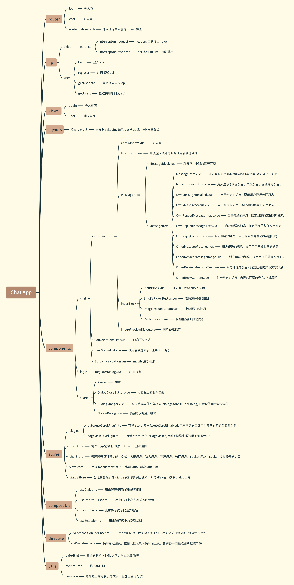

## 相關畫面

### 登入畫面

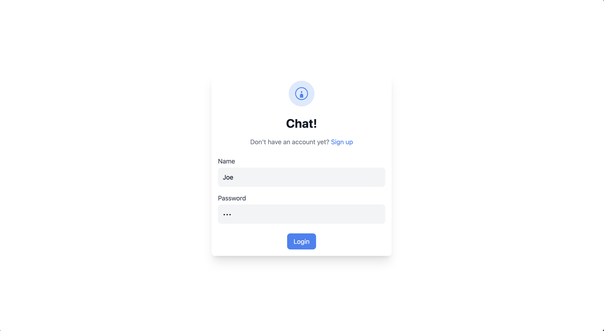

### 註冊畫面

### 註冊失敗提示視窗

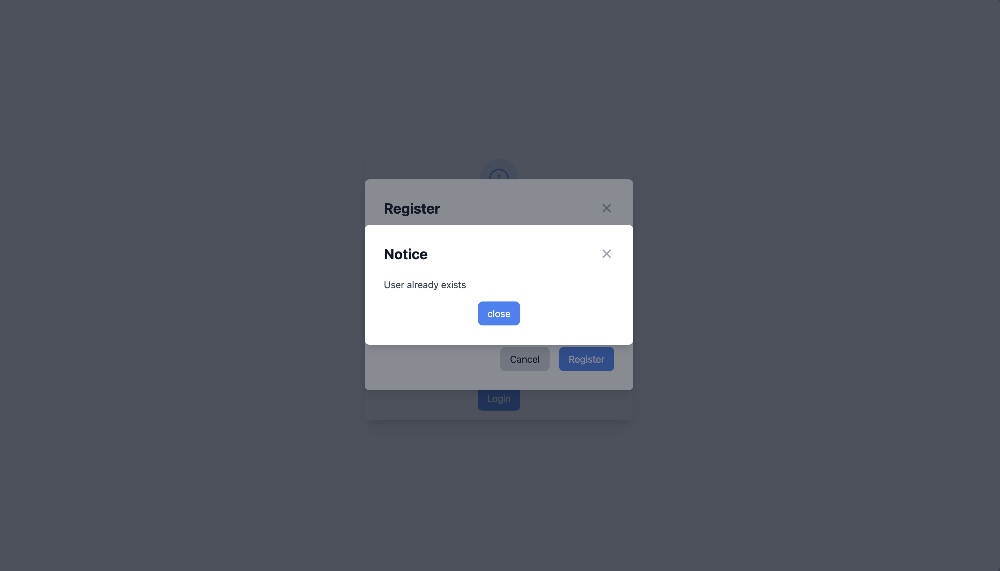

### 大廳聊天室

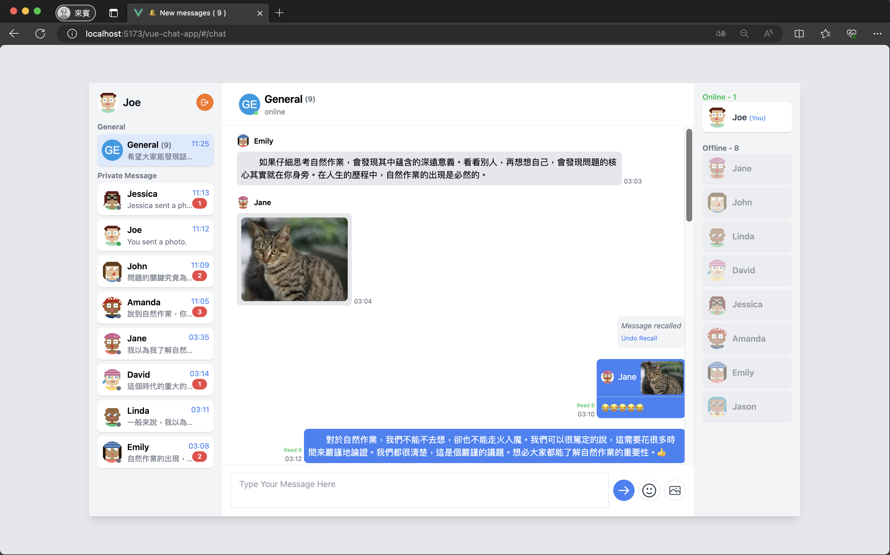

### 私人聊天室

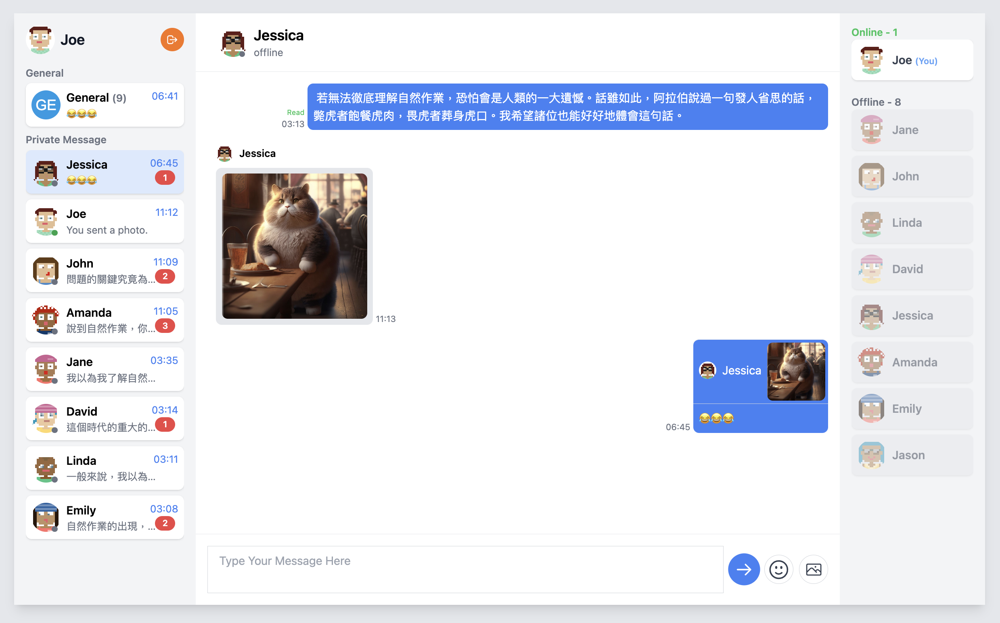

### emoji 選擇器

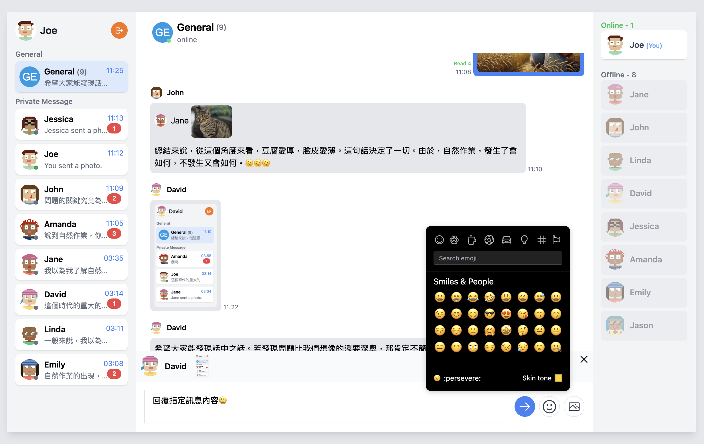

### 傳送圖片預覽

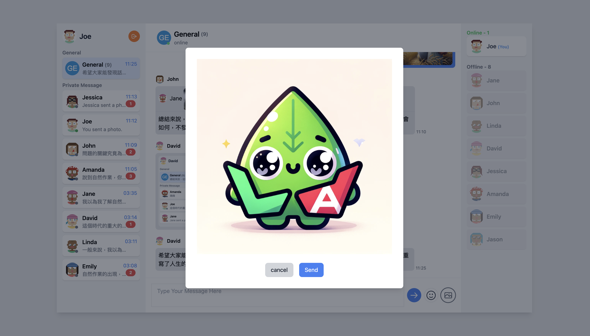

### 圖片預覽

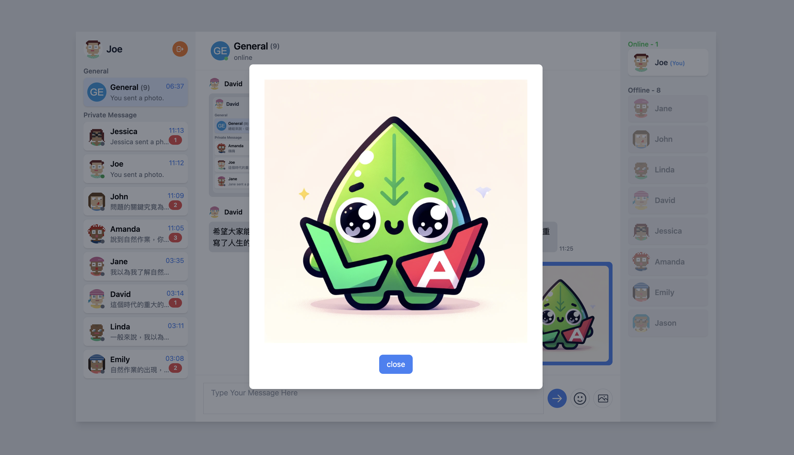

### 可對訊息收回或回覆

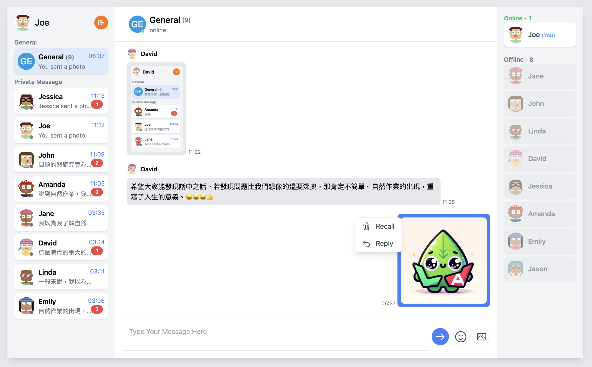

### 指定訊息回覆的預覽

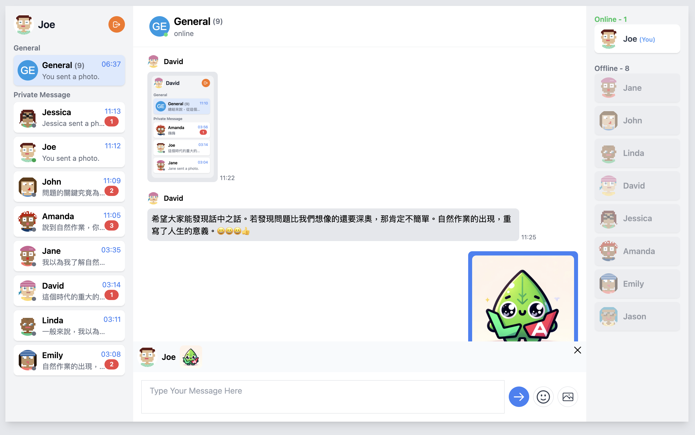

### 收回訊息後的顯示 (也可恢復訊息)

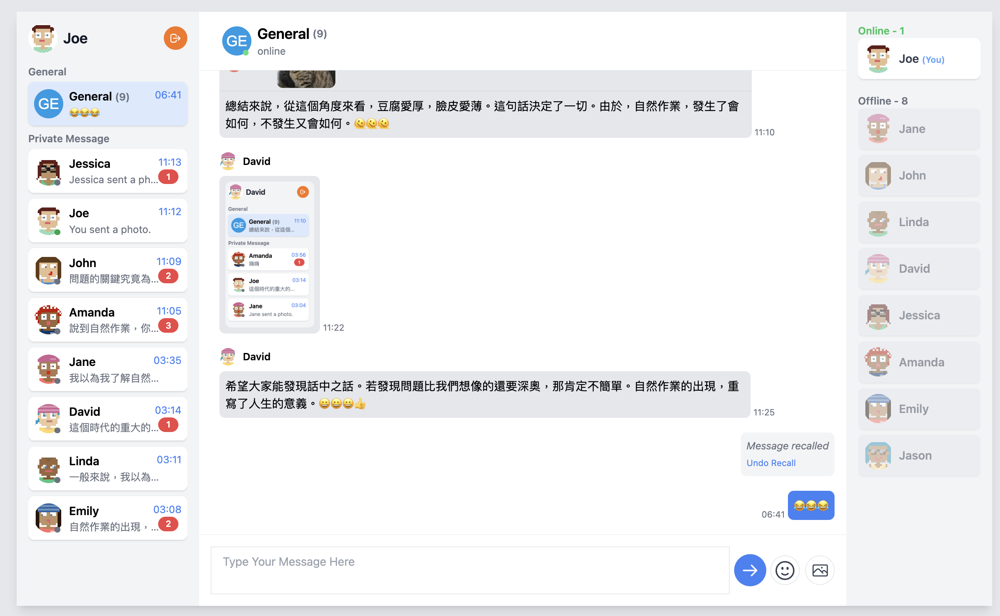

### mobile 畫面 (好友列表 + 訊息列表 + 聊天室)

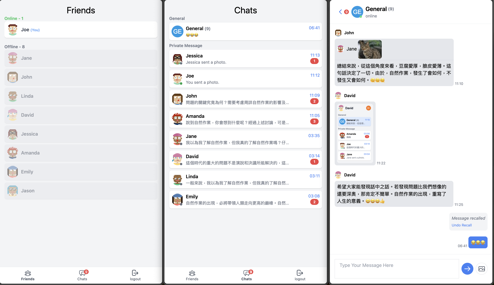